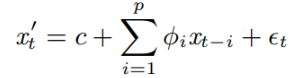
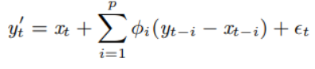
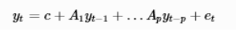
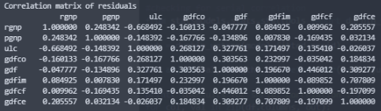
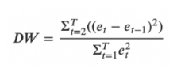
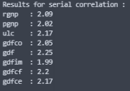
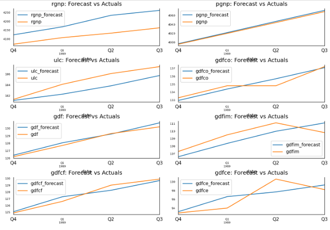
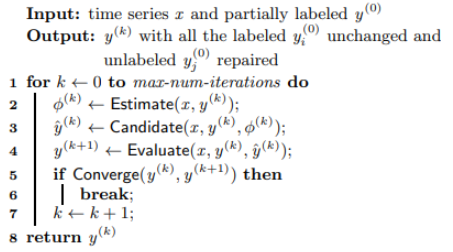
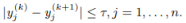

# VAR-model

## Abstract

Vector Autoregressive (VAR) models are widely used in time series research to examine the dynamic relationships that exist between variables that interact with one another. The idea here is to estimate an accurate VAR model based on a history dataset, while using an unsupervised approach in order to forecast the already existing values and try to find anomalous multivariate time series data and then predict it’s probable corrections via iterative minimum repairing.It is considered as an Autoregressive model because, each variable (Time Series) is modeled as a function of the past values, that is the predictors are nothing but the lags (time delayed value) of the series.

### Remark :

I used a training dataset from this repo `https://raw.githubusercontent.com/selva86/datasets/master/Raotbl6.csv`.

## Walk through

+ visualize the data with

$ `VisualizeMultiData.py`

+ split the series into training and testing Datawith

$ `SplitData.py`

+ you can inherently detect anomalies with

$ `VarTrain.py`

By using the selected lag, we fit the VAR model and find the squared errors of the data. The squared errors are then used to find the threshold, above which the observations are considered to be anomalies.

+ check for stationarity or make the time series stationary with

$ `model.py`

A stationary time series is one whose characteristics like mean and variance does not change over time.
If the series are not stationary we difference them until they become stationary.
Differencing reduces the length of the series by 1.

+ test Causation using Granger’s Causality Test

$ `GrangersCausalityTest.py`

The basis behind Vector AutoRegression is that each of the time series in the system influences each other. That is, you can predict the series with past values of itself along with other series in the system.Using Granger’s Causality Test, it’s possible to test this relationship before even building the model.

Granger’s causality tests the null hypothesis that the coefficients of past values in the regression equation is zero.(the past values of time series (X) do not cause the other series (Y)). Therefore, if  the p-value obtained from the test is lesser than the significance level of 0.05, then, you can safely reject the null hypothesis.

+ perform a cointegration test with

$ `CointegrationTest.py`

Cointegration test helps to establish the presence of a statistically significant connection between two or more time series. Order of integration(d) is a number of the differencing required to make a non-stationary time series stationary.in conclusion, if a linear combination exists between two or more time series and has an order of integration (d) less than that of the individual series, then the collection of series is said to be cointegrated, as a consequence they have a statistically significant relationship.

### Theory behind VAR model formula:

#### Univariate case : auto regressive model (AR(p))

x′t is the prediction of xt
p is the order
φi is the parameter of the model
c is a constant defined by c = µ(1− i=1pφi)
µ is mean value of the process
t is white noise

#### Univariate case with partially labeled Data : (ARX(p))

y′t is the possible repair of xt, and others are the same to the aforesaid AR model
yt-i is composed of partially labeled data in this case

#### Multivariate case : (VAR(p))

where Yt=(Y1t,...,YKt)' is a set of K time series variables,
C is a K × 1 vector of constants
Ai’s are K×K coefficient matrices
and t are error terms

+ To Select the Order (P) of VAR model before; train the VAR model of selected lag order(p) (4 in this case).
+ the order that has the lowest AIC score is the fittest
+ To check for serial correlation of residuals (Errors) : (I used durbin watson statistic)

#### the output matrix  in my case :

If there is any correlation left in the residuals, then, there is some pattern in the time series that is still left to be explained by the model. In that case, the typical course of action is to either increase the order of the model or induce more predictors into the system or look for a different algorithm to model the time series.

#### the Durbin Watson’s Statistic:

The value of this statistic can vary between 0 and 4. The closer it is to the value 2, then there is no significant serial correlation. The closer to 0, there is a positive serial correlation, and the closer it is to 4 implies negative serial correlation.

### Forecast results 

+ To evaluate the forecasts, we can compute a comprehensive set of metrics, namely : the MAPE, ME, MAE, MPE, RMSE, corr and minmax.

### Iterative minimum repairing on multivariate data

#### Univariate case 

The purpose is that the term  converges after a certain number of forecasts.

By applying this principle on multivariate data on its stationary form we get a vector threshold, and we repair the
detected anomalies.

### Conclusion

In the context of unsupervised machine learning, vector autoregressive models (VAR) fits best when we use a history dataset that is partially labeled but it does provide credible results even if used with unlabeled data we just need causation between time series and the best lag order.
